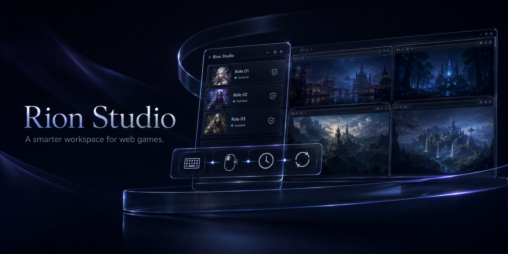

# Rion Studio

English | [繁體中文](docs/README.zh-TW.md) | [简体中文](docs/README.zh-CN.md) | [日本語](docs/README.ja.md)

**A cross-platform game launcher and assistive workspace for web games.**

Rion Studio helps web game players keep every role, browser session, and window
layout organized in one desktop app. Create dedicated browser roles, launch the
game screen directly, and reduce repetitive manual actions while you stay
actively in control of play.

## Download

- [Download for macOS](https://github.com/rion-tw/rion-studio/releases/latest/download/Rion.Studio-mac.dmg)
- [Download for Windows](https://github.com/rion-tw/rion-studio/releases/latest/download/Rion.Studio-win.exe)

These links point to the installer assets attached to the latest GitHub release.
If a download returns 404, open the [latest release](https://github.com/rion-tw/rion-studio/releases/latest)
and confirm the release has finished uploading assets.

### macOS Installation

The macOS app uses an ad-hoc code signature and is not notarized. Open the DMG,
drag Rion Studio to Applications, then launch it. macOS may block the first launch;
use **System Settings → Privacy & Security → Open Anyway** only when the DMG came
from the official Rion Studio GitHub release and its published checksum matches.

### Windows Installation

The Windows installer remains unsigned, matching the original distribution.
Windows may show a SmartScreen warning; continue only when the installer came
from the official Rion Studio GitHub release and its published checksum matches.

## Why Rion Studio

Web games often make players juggle multiple accounts, browser windows, saved
browser sessions, and repeated routine actions. Rion Studio turns that scattered workflow
into a focused control desk:

- Keep each game role in its own isolated browser session.
- Return to saved window layouts instead of rebuilding your setup every time.
- Run small assistive macros for keys, clicks, delays, and loops under your
  supervision.
- Keep passwords out of the app. Rion Studio stores browser session data only.

## Features

### Isolated Role Browsers

Create a role for each game account, character, or task. Every role owns its own
browser directory, so sessions stay separate and can be launched independently.

### Direct Game Launch

Roles and launch workspaces always open their configured game URL directly.
Rion Studio does not track whether a role is signed in, require a re-login, or
hold an authentication status.

### Launch Workspaces

Group roles into a launch workspace and assign each one a window layout. Start a
single role or launch a full multi-role setup into the arrangement you already
prepared.

### Human-Supervised Macros

Build compact assistive macros from key presses, clicks, delays, and repeat
intervals. Macros are designed to reduce repetitive manual input while you remain
present, supervising, and operating the game.

## Legal And Fair Use Notice

Rion Studio is an independent, general-purpose launcher and human-supervised
assistive utility. It is not affiliated with or endorsed by any game, identity
provider, Google, Chrome, Facebook, or other third-party platform. Always follow
the target service's rules and do not use Rion Studio for unattended botting,
anti-cheat evasion, exploits, disruption, or unlawful activity.

Review the complete, versioned documents before use:

- [Terms of Use](docs/legal/terms.en.md)
- [Privacy Notice](docs/legal/privacy.en.md)
- [Fair Use Rules](docs/legal/fair-use.en.md)
- [Third-Party Software Notices](docs/legal/THIRD_PARTY_NOTICES.md)
- [All supported languages](docs/legal/README.md)

## Support And Feedback

The [public distribution repository](https://github.com/rion-tw/rion-studio) is
the download and product-support home for Rion Studio. Use
[GitHub Issues](https://github.com/rion-tw/rion-studio/issues) for product bug
reports and feature requests. Source-code pull requests are not accepted; see
[SUPPORT.md](SUPPORT.md) and [SECURITY.md](SECURITY.md) for the appropriate channels.
