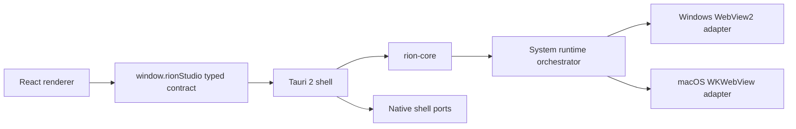

# Rion Studio 系統原生引擎與 Tauri 2 單殼遷移計畫

## 0. 文件狀態

最後更新：2026-07-26

這份文件是後續實作的唯一主計畫。2026-07-26 起產品方向改為：

- 完全取消 CDN 相容／改寫／偵測功能。
- 完全取消外開 Chrome、Chrome Profile 匯入與 External Chrome CDP runtime。
- 新安裝與既有資料一律收斂到作業系統原生 WebView：Windows WebView2、macOS WKWebView。
- Electron 只保留為短期舊殼與建置期間的相容元件，不再是產品瀏覽器引擎或 runtime fallback。
- Tauri 2 會成為唯一桌面殼；基本重構與雙平台原生 gate 通過後，從產品依賴、打包與原始碼完全移除 Electron。

舊計畫中所有「CDN 不支援則 fallback Electron」、「External Chrome 最後相容路徑」、「Chrome Profile 固定 Electron」、
「Tauri 隨附 Electron runtime helper」決策自本版起作廢。

## 1. 完成定義

完成後的產品只有一種使用者可選的瀏覽器引擎：`system`。設定頁仍保留「瀏覽器引擎」欄位，
用來清楚顯示目前平台實作與未來擴充入口，但不再提供 Electron／External Chrome 選項：

- Windows：System（WebView2）。
- macOS 14+：System（WKWebView）。
- 舊資料中的 Electron、external、Chrome Profile、legacy pin 由 schema migration 正規化成 System／managed session。
- 無法搬移的登入資料不偽裝成功；保留 System store、清除舊引擎 pin，第一次啟動要求重新登入。
- 不再以另一個瀏覽器引擎掩蓋 capability 缺口。硬需求不支援時，顯示精確診斷並停止該次啟動。

「完整涵蓋 Rion Studio」改為所有仍在產品範圍內的流程都由 WebView2／WKWebView 實作。已取消的 CDN、
External Chrome 與 Chrome Profile 匯入不屬於 parity 範圍，必須從 UI、契約、資料、診斷、測試與文件真正刪除。

## 2. 目標架構

邊界規則：

- `rion-core` 是 SQLite、角色／工作區、runtime 狀態、巨集、恢復與交易的唯一權威。
- renderer 只使用 `window.rionStudio`，不直接 import Tauri、Node、Electron、WebKit 或 WebView2。
- 遊戲 surface 直接使用 WebView2 COM／WebKit/AppKit；不受 WRY 的共同最小 API 限制。
- 平台差異只存在 `rion-platform`、Tauri shell adapter 與 native addon／FFI 邊界。
- 不新增 Electron fallback，也不讓 Tauri 啟動 Electron helper。
- 原生能力缺失以 capability error、診斷與可恢復 UI 呈現，不能靜默換引擎或假成功。

## 3. 刪除矩陣

### 3.1 CDN 全面移除

必須刪除：

- Rust `cdn`、`cdn_detection` 模組、規則資產、domain records、commands、effects、SQLite tables／settings 與 telemetry。
- WebView2 `WebResourceRequested` CDN 規則、WKWebView CDN capability、Electron session 攔截器。
- main/preload/shared IPC、設定 UI、相容性面板、狀態摘要、i18n、診斷匯出欄位。
- CDN 專用 tests、fixtures、parity ledger、release evidence 與文件說明。

資料遷移必須容忍舊 SQLite 欄位／表仍存在，但 runtime 不讀取、不寫入、不匯出。為避免破壞既有使用者資料，
第一個 migration 只停止使用；後續 schema compact 版本再實體 drop。

### 3.2 外開 Chrome 全面移除

必須刪除：

- `launchMode=external/auto` 的產品行為；角色永遠以 System WebView 啟動。
- External Chrome process discovery、啟動、CDP transport、session health、automation、overlay 與 diagnostics。
- Chrome Profile discovery/import/copy/cookie injection/rollback 與相關 shell dialog。
- `BrowserSessionSource=chrome-profile`；公開模型只保留 `managed`。
- Rust commands/effects、N-API、shared generated types、IPC、Electron adapters、renderer flow、i18n 與 tests。
- `RION_STUDIO_CHROME_PATH`、`CHROME_PATH` 等產品環境變數與文件。

舊角色若為 external／auto／chrome-profile，migration 將其設為 System + managed；不再讀取原 Chrome profile，
也不刪除或修改使用者原始 Chrome 資料。若無可用 System 登入狀態，UI 只提示重新登入。

### 3.3 Electron 收斂與最終移除

第一階段先停止 Electron 作為瀏覽器引擎：

- 從公開 engine union、resolver、fallback plan、capability matrix 與 UI 選項移除 Electron。
- 移除 System → Electron cookie mirror 與 crash fallback；crash 改為同引擎重建／可恢復失敗。
- 停止新增或封裝 Tauri Electron runtime helper；刪除 helper protocol、launcher 與 Tauri resource。

第二階段在 Tauri shell parity 完成後移除舊 Electron 殼：

- 刪除 `src/main`、`src/preload`、Electron Vite config、Electron builder config 與 Node-API host glue。
- 移除 `electron`、`electron-vite`、`electron-builder`、`electron-updater` 與只為 Electron 存在的套件／scripts。
- `rion-node` 若沒有其他消費者則刪除；Rust core 改由 Tauri 直接 link。
- package/release/CI 只產生 Tauri artifacts。

## 4. 產品模型與遷移

最終公開模型：

- `EmbeddedBrowserEngine = "system"`，或在沒有未來第二引擎需求時完全移除這個可變 union。
- `ResolvedBrowserEngine = "webview2" | "wkwebview"`。
- `BrowserHostKind = "system-native"`。
- session source 不再是公開可變模型；所有角色資料皆由 Rion 管理的 System store 持有。
- 全域／遊戲／工作區 engine override 在過渡 migration 後可從資料庫與公開 API 移除；UI 顯示唯讀平台引擎。

遷移原則：

1. 先讓新版 reader 接受所有舊 enum value。
2. 單一 SQLite transaction 將 Electron、external、auto、chrome-profile、legacy pin 與 workspace override 正規化。
3. 保留未知欄位的 forward-safe 行為；不因舊值而拒絕開庫。
4. 不複製 LocalStorage、IndexedDB 或 Service Worker 的 raw files。
5. 不搬移舊 Electron／其他瀏覽器的 cookie；升級後若 System store 沒有有效登入狀態，明確要求重新登入。
6. portable import 接受舊 schema，但 portable export 只輸出新模型。
7. migration、reset、delete 永不觸碰使用者原始 Chrome profile。

## 5. 系統 WebView 完整能力範圍

| 能力 | Windows WebView2 | macOS WKWebView | Gate |
|---|---|---|---|
| 角色隔離 | 每角色獨立 UDF/profile | 每角色 persistent `WKWebsiteDataStore` | 不可互讀 cookie/storage |
| Navigation／驗證 | navigation events | navigation delegate | 未驗證不得標 running |
| Proxy | environment arguments | macOS 14 data-store proxy config | 啟動前精確驗證 |
| 巨集輸入 | WebView2 CDP Input | 受控 WebKit automation/NSEvent adapter | `isTrusted`、背景 target、hold/release |
| JS/frame/layout | CDP + script APIs | content world/frame API + isolated SPI | iframe 與跨來源案例 |
| Overlay/binding/init | document-created script/host objects | user script/message handler | navigation/popup 後重建 |
| Popup | shared-profile child surface | shared-data-store child surface | bounds/focus/audio/close/crash |
| 1–9 角色 layout | native child surfaces | NSView child surfaces | 所有 template pixel parity |
| Zoom/audio/mute | WebView2 APIs | page zoom/media state + guarded mute SPI | 狀態與 UI 一致 |
| Fullscreen/tabs/display | Tauri host + native surface | Tauri/AppKit host + native surface | hotplug/reorder/hide/restore |
| Download/upload | WebView2 callbacks | WKDownload/open panel | 共用 native dialog policy |
| Permission/cert/JS dialog | WebView2 events | UI/navigation delegates | 未定義權限預設拒絕 |
| Crash recovery | process-failed 後同引擎重建 | process terminated 後同引擎重建 | 有界重試、狀態不假成功 |
| Graphics | 僅映射已驗證選項 | OS/WebKit 管理 Metal | 不適用即明示 |
| Custom fonts | document-start stylesheet | WKUserScript stylesheet | full/degraded 狀態 |

CDN 改寫、External Chrome 與 Chrome Profile 不出現在 capability matrix。

### macOS 14+ SPI 原則

- 公開 API 優先，SPI 集中在單一 adapter，不散落 core、renderer 或 Tauri commands。
- 以 runtime selector/class lookup、OS build allowlist、ABI smoke probe 與 crash boundary 隔離。
- 不要求 Safari Develop menu；不以 `isTrusted=false` DOM event 冒充巨集成功。
- 若可信背景輸入在特定 macOS build 不成立，阻止需要該能力的巨集啟動並提供診斷；不 fallback Electron。
- 相容性 manifest 只能停用 capability，不能下載或執行程式碼。

## 6. Tauri 2 唯一外殼

Tauri 必須完成：

- 主視窗、window state/fullscreen、monitor/display 事件與最小尺寸。
- tray／Quick Menu、角色／工作區啟動、顯示所有遊戲視窗、正常退出。
- file/directory/save dialogs、open external HTTPS、reveal logs。
- single-instance lock、authenticated activation forwarding、SQLite online backup。
- runtime restore：啟動標記 unclean、乾淨退出保存、crash 後恢復 tabs/layout/display/audio/hidden 狀態。
- updater：平台簽章 artifact、檢查、下載、安裝／重啟、失敗回復與 UI 狀態。
- diagnostics／portable import/export／graphics diagnostics（限系統 WebView 能提供的資料）。
- capability allowlist：bundled renderer 可呼叫完整 app command；遠端遊戲頁只可呼叫由目前 WebView 身分綁定的 overlay request，不能取得角色參數或其他 Tauri API。

過渡期允許 Electron Stable 與 Tauri Preview 共用資料但不能同時執行；Tauri 成為預設後停止發布 Electron Stable。
資料 schema 必須先維持一個發行週期可由舊 Stable 讀取，之後才做 destructive schema compact。

## 7. 執行階段

### Phase A：方向切換與產品刪除

- [x] 鎖定取消 CDN、External Chrome、Chrome Profile 與 Electron runtime fallback 的決策。
- [x] 移除 CDN 全層功能與測試。
- [x] 移除 External Chrome／Chrome Profile 全層功能與測試。
- [x] 更新 schema／portable migration，舊資料安全正規化。
- [x] 讓 System 成為唯一產品 engine，更新 UI、i18n、diagnostics、capability matrix。

### Phase B：純 System runtime

- [x] WebView2/WKWebView surface、角色 store、navigation、layout、zoom、focus、mute 基礎實作。
- [x] popup、下載／上傳、proxy、字型、permission/cert/JS dialog 基礎實作。
- [x] 移除 Electron surface union、fallback effects、cookie shadow mirror 與 helper dependency。
- [x] 完成原生 crash 同引擎有界重建、session recovery、runtime restore 與 clean/unclean exit 標記。
- [ ] 完成可信背景巨集與所有平台 capability gate。

### Phase C：Tauri shell parity

- [x] Tauri crate、共用 renderer bridge、core direct-link、資料 lock／backup／activation。
- [x] 基本 native dialogs、tray／Quick Menu、manual update status adapter。
- [x] 完成 window/display watcher、display removal reconcile、restore/clean-exit、portable/diagnostics 基本流程。
- [ ] 完成實體 display hotplug callback 與跨螢幕 restore 的雙平台 packaged/manual edge-case smoke。
- [x] 完成 portable/diagnostics 成功路徑、損壞輸入、原子 replace 失敗與暫存清理的雙平台 packaged gate 接線。
- [x] 以 Tauri/native adapter 直接執行 runtime effects，不啟動 Electron helper。
- [x] 刪除 helper protocol、helper launcher、bundle resource 與相關測試。

### Phase D：移除 Electron

- [ ] Tauri 在 macOS 14+、Windows 10/11 通過 1/3/6/9 角色完整 parity。
- [ ] 切換開發、build、package、updater 與 release scripts 到 Tauri-only。
- [ ] 移除 Electron 主殼、preload、N-API host glue、套件與 builder config。
- [ ] 清理 SQLite 舊欄位／表與不再使用的 browser store metadata。
- [ ] 更新 README、法律文件、架構文件與貢獻指南。

### Phase E：發佈 gate

- [ ] macOS Developer ID、hardened runtime、notarization、stapling、乾淨機 Gatekeeper。
- [ ] Windows Authenticode、NSIS install/upgrade/uninstall、WebView2 Runtime 缺失／損壞流程。
- [ ] updater 成功、下載中斷、簽章錯誤與 rollback 演練。
- [ ] SQLite 升級、portable 舊版匯入、crash recovery 與 single-instance 演練。
- [ ] System 1/6/9 角色 RSS、CPU、resize、macro p95、100 次 create/destroy 無資源洩漏。
- [ ] `macos-latest`、`windows-latest` CI 全綠，並完成實際 macOS 14+、Windows 10/11 桌面 smoke。

## 8. 自動測試與驗收

- Rust：migration、舊 enum 正規化、單一 System resolver、transaction rollback、runtime ordering、macro key ownership。
- Contract：Rust generated types、Tauri bridge 與 renderer API 完全一致；不再出現 CDN／external／chrome-profile。
- 平台 adapter：所有測試明確傳入 macOS／Windows，不繼承開發機平台。
- Native fixture：cookie/storage isolation、popup、iframe、audio/mute、fullscreen、download、upload、permission、cert、dialog。
- 巨集：trusted tap/hold/repeat/modifier/release、1/3/6/9 角色、1000 次 start/stop 無 stuck key、hidden target 不誤送。
- 恢復：web process crash、app crash、display hotplug、更新中斷、store lock、clean/unclean exit。
- 靜態負面 gate：repository production source 不得含 CDN command/effect、External Chrome runtime、Chrome Profile import
  或 Electron helper；Phase D 切殼後再禁止 Electron package dependency。

目前 `pnpm run verify:system-only` 已成為一般 CI、雙平台 package smoke 與 Tauri signed candidate 的必要步驟；
它會檢查已刪除檔案、production token、唯一 engine union、resolved engine union 與不再允許的 Electron object effects。
Electron package dependency 只在 Phase D 最後切殼時才納入同一 gate，避免過渡殼尚在使用時製造假失敗。

## 9. Release gates 與已知限制

- System 是唯一引擎後，任何原生缺口都不能靠 fallback 隱藏；release gate 必須比舊雙引擎方案更嚴格。
- macOS trusted background input 仍是最高風險。若特定 OS build 未通過，只停用需要該能力的巨集，不停用一般遊戲瀏覽。
- WKWebView 與 WebView2 session 格式不同，跨平台／跨舊引擎只能做明確支援的 cookie migration；不能保證免登入。
- 更新器正式發佈必須依賴 OS code signature。開發版 manual updater 不是正式 release gate 的替代品。
- 本計畫支援 macOS 14+、Windows 10/11 x64；不涵蓋 Linux、Windows ARM64、Intel macOS 或 Mac App Store。

## 10. 目前實作證據與 Electron 刪除門檻

截至 2026-07-26 已完成：

- CDN、External Chrome、Chrome Profile 與 Tauri Electron helper 已從產品路徑和公開契約刪除。
- Rust `CoreEffectAction` 已移除 Electron window/view attach、cookie/session、舊 debugger 等 object-level effect；
  過渡 Electron shell 只轉送 Rust 定義的 System runtime、相容性、overlay 與 browser action。
- Tauri 直接 link `rion-core`，直接建立角色／工作區 System WebView，並具備角色 store、proxy、popup、download、
  upload、權限與憑證拒絕策略、JS dialog、同引擎 crash recovery、顯示器 reconcile 與 runtime restore。
- Quick Menu 可顯示／停止執行中角色與工作區、停止全部角色、遵守法律文件 gate，並可恢復已保存遊戲視窗。
- diagnostics 已改為 `engine + engineVersion + shell + shellVersion`，不再把 Electron／Chromium／Node 當產品引擎版本。
- Tauri updater 使用官方簽章驗證鏈；signed release-candidate workflow 會驗證 Developer ID/notarization/stapling、
  Authenticode、updater signature 與 `latest.json`，但尚不發布 stable。

在以下條件同時成立前不刪除 Electron 舊殼：

1. macOS packaged harness 證明 trusted/background key、mouse、hold/release 的 `isTrusted` 與無 stuck key；
   目前已在 macOS 26.5 同時完成 native harness 與最新 release Tauri app bundle：背景 key/mouse、hold/release、
   Shift modifier、repeat、1000 次 press/release、1/3/6/9 角色像素佈局（共 19 個隔離 store）、同 store popup、
   WKWebView native open-panel callback 與逐 byte upload、native download、實際終止 Web Content process
   後的 callback／同引擎恢復，以及 100 次 create/destroy
   均通過。只有同一 OS major、且由通過 harness 的 CI build 注入 attestation 時 capability
   才升為 `supported`；其他 build／major 維持 `degraded` 並讓帶有 enabled macro 的角色 fail closed。
   Stable 的最低 macOS 版本必須收斂到已 attested 的最低 major。
2. Windows 10/11 packaged harness 完成相同輸入 gate，並驗證 WebView2 Runtime 缺失／損壞提示。目前同一套
   Tauri/WebView2 harness 與 CI attestation 接線已完成，但仍須取得 `windows-latest`、Windows 10 與 Windows 11
   的實際通過結果，才能把 Windows capability 視為已驗證。
3. 兩平台通過 1/3/6/9 角色、popup、download/upload、mute、proxy、crash、restore、hotplug 與 100 次 create/destroy smoke。
4. signed candidate 安裝、升級、更新失敗與乾淨機驗證完成，且 `macos-latest`／`windows-latest` CI 全綠。
5. 才將 Tauri identifier/product name 切為 stable，切換預設 scripts/release，刪除 `src/main`、`src/preload`、
   `rion-node` 與 Electron packages，最後把 Electron dependency 檢查加入 `verify:system-only`。

補充的 packaged gate 實作證據：

- `pnpm run test:native:system-input` 會啟動 Tauri binary 的內建診斷模式，使用正式 child WebView 與正式
  key/mouse dispatch，輸出原子 JSON attestation；CI 在 attestation 通過後才注入對應 capability build env。
- CI 與 signed-candidate workflow 在 bundle 前跑 debug attestation，bundle 後再對 release executable 重跑，
  因此不以 mock、Electron 或單純編譯成功代替 packaged 行為。
- macOS mute 使用 WebKit `_setPageMuted:` SPI 的動態 selector 檢查；公開的
  `setAllMediaPlaybackSuspended:` 會暫停 media，無法維持原有 mute 行為。selector 缺失時回傳 capability 錯誤，
  不再像舊 `_setMuted:` 呼叫一樣造成 Objective-C foreign exception 與整個程序 abort。
- 1-role 結束後立即建立 3-role 的 smoke 曾重現 runtime mutex 與 main-thread Destroyed callback 的鎖順序死結；
  `create_tab` 現已只在狀態檢查／提交時持鎖，所有 native 建窗與 callback 都在鎖外執行。
- popup gate 由可信原生滑鼠事件觸發真正的 `window.open`，驗證 child surface 沿用同一角色 data store，
  關閉後釋放 native window 與 `popup_roles`；download gate 經正式 WebView download callback 寫入診斷目錄，
  並逐 byte 驗證內容。upload gate 在 macOS 由可信滑鼠觸發 `<input type=file>`，確認 WKWebView 呼叫其
  native `runOpenPanel` delegate，再驗證檔名、大小與逐 byte 內容；Windows 自動化使用 WebView2
  `DOM.setFileInputFiles` 驗證瀏覽器檔案處理，但原生 chooser UI 仍保留 signed-candidate manual smoke。
  最新 debug 與重建後的 release `.app` executable 均已通過 macOS upload/download gate。
- macOS full-size content view 包含 titlebar 區域；若直接以該 bounds 排版，6-role 上排會少 16px，DOM mouse Y
  也會偏移。runtime 現從 AppKit `contentLayoutRect` 取得可用內容區與 top inset，1/3/6/9 每個 child WebView
  的 `innerWidth/innerHeight` 都與 native pixel bounds 比對，滑鼠座標也走同一轉換。
- crash gate 不再直接呼叫恢復函式。macOS 診斷會讀取該 WKWebView 的 `_webProcessIdentifier` 並只終止該
  Web Content 子程序；只有 Tauri/WRY 的實際 termination callback、舊 handle 釋放、同 store 重建、
  localStorage 保留與背景可信輸入恢復全部成立才通過。這個 gate 同時找出並修正 WRY 對已死亡 WKWebView
  空 URL 的 unwrap panic：導覽目標現在會在 native navigate 前先保存於 Rust state，恢復時不查死 surface。
- `pnpm run test:native:runtime-restore` 以同一個隔離 userData 連續啟動三個真實 Tauri 程序：第一個建立並
  先把 live 角色放在合成 display，再走正式 `EmbeddedDisplayRemove` effect 搬到實際 fallback 螢幕；接著
  持久化角色與 localStorage、把已保存 target 改為合法但不存在的 display ID，然後刻意繞過 clean shutdown；
  第二個必須顯示 unclean recovery、走正式 `restoreSavedGameWindows` 回退到當前可用螢幕、
  清除 dormant/recovery 狀態並保留角色 store，然後正常退出；第三個則必須判定為可自動恢復且不顯示
  crash recovery。最新 debug 與重建後的 release `.app` executable 均已通過。
- 這個跨程序 gate 找出兩個正式路徑問題：monitor hash 原先可能超出 JavaScript safe integer，導致真實
  display 被 Rust domain 拒絕；以及 restore 的 active/hidden tab command 會在 Tokio runtime 內落回同步
  effect plan 並 panic。display ID 現限制在 safe-integer 範圍，`invoke_async` 的同步 fallback 一律透過
  `spawn_blocking`，並有 Rust regression coverage。
- `pnpm run test:native:file-operations` 由正式 Tauri executable 執行 portable export/preview 與 diagnostics ZIP，
  驗證 schema/ZIP 內容並拒絕損壞 import；再把既有目錄當成輸出目的地，讓原子 replace 在產生暫存檔後失敗，
  確認 portable/diagnostics 暫存檔全部釋放、目的地未被覆寫且 games/roles/workspaces/macros 未變。一般 CI 與
  signed candidate 都會在 debug attestation 與 bundle 後的 exact release executable 各跑一次。
- proxy gate 會以帶有實際 proxy URL 的 child WebView 驗證建立時設定。macOS 自動 gate 檢查該
  `WKWebsiteDataStore.proxyConfigurations` 確實非空；由於簡易自製 CONNECT relay 無法可靠代表系統代理，
  macOS 端到端傳輸保留給使用成熟代理的 signed-candidate smoke。Windows gate 則另外要求 loopback target
  確實經 WebView2 proxy 抵達。不可把 macOS 的配置 gate 描述成 transport 已自動驗證。

## 11. 中斷續作 checkpoint

每次中斷後依序恢復：

1. 讀本文件與 `.agents/context.md`，確認目前 Phase checkbox。
2. 執行負面搜尋，確認是否仍有 CDN／External Chrome／Chrome Profile 的 production references。
3. 執行 `cargo check -p rion-tauri`、`pnpm run typecheck`，先修復共享契約斷點。
4. 依 Rust core → generated contract → Tauri bridge → renderer → tests 順序完成一條垂直切片。
5. 每一批刪除後跑 focused tests；Phase 完成時跑 Rust、Vitest、lint、native build 與雙平台 CI。
6. Electron 僅在 Tauri parity 尚未完成時保留舊殼；不得再為 Electron 新增產品能力。
7. 原生／封裝行為變更後執行 `pnpm run test:native:system-input`；macOS 本機通過不能取代 Windows CI 與
   Windows 10/11 實機結果。
