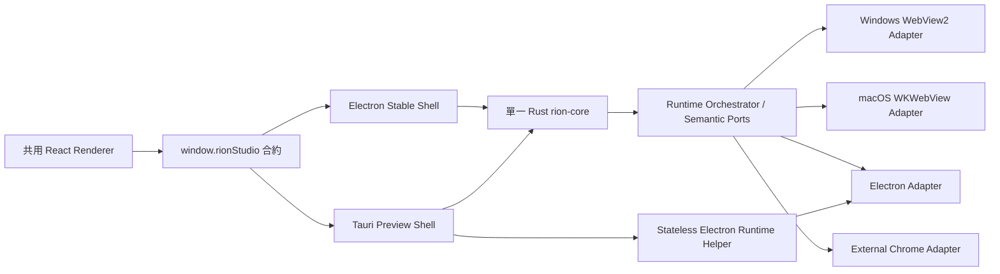

# Rion Studio 系統原生引擎與 Tauri 2 雙殼遷移計畫

## 實作進度（持續更新）

最後更新：2026-07-25

- [x] 建立並鎖定本文件中的產品決策、fallback 規則、平台矩陣與 release gates。
- [x] 完成 Phase 1 的引擎／session 資料模型：System、Electron、WebView2、WKWebView、External Chrome、inherit、legacy pin、capability 與 fallback reason。
- [x] SQLite schema v8：既有角色固定 Electron、舊 `embedded` session source 遷移為 `managed`、既有工作區固定 Electron、全域預設 System；另加入完整版本鍵的 engine compatibility cache 與不含敏感資料的 session migration checkpoint。
- [x] Portable schema v8 與舊 JSON migration；登入資料、cookie 與 session 仍不進 portable export。
- [x] 完成全域 → 遊戲 → 工作區解析器；混合遊戲偏好的工作區必須先保存 System 或 Electron 覆寫。
- [x] 設定、遊戲編輯器與工作區編輯器已加入引擎選項；en、zh-TW、zh-CN、ja 已同步。
- [x] Runtime status 已區分 preferred/resolved engine、host kind、fallback reason；Phase 1 相容版會如實顯示 System → Electron fallback。
- [x] 抽出 `RuntimeHostPort`、`WebSurfacePort`、`AutomationTargetPort`；現有 Electron runtime 與巨集 adapter 已開始使用語意介面。
- [x] 每角色已建立 Electron、System、WebView2 與 WKWebsiteDataStore key 的獨立路徑／識別；reset 與刪除交易涵蓋兩套 managed store。
- [x] 加入 macOS／Windows 系統 WebView runtime 與 API/SPI capability probe；未通過可信／背景輸入實機 gate 前不會誤升級為 System executor。
- [x] Cookie-only session migration 已完成 preview/apply/rollback、auth verification、啟動復原 journal、原子 engine pin/checkpoint commit；來源 store 不動，失敗或 rollback 會清除目標 store。
- [x] Windows WebView2 native prototype、TypeScript surface、cookie/data adapter 與 CDP-based trusted input adapter 已完成；Windows CI 負責真實編譯與 native smoke gate。
- [x] macOS WKWebView/AppKit public-API surface、persistent data store、cookie/data adapter、生命週期事件與受控 audio SPI 已完成；native smoke tests 已納入既有 addon gate。
- [x] Windows/macOS 打包資源、native build/verify scripts 與雙平台 CI/release job 已接線。
- [x] Resolved engine 已寫入 Rust 產生的 create/load effects；Electron adapter 對非 Electron effect 會 fail closed，不會靜默冒充 System。
- [x] System native surface pool 已完成角色 ownership、平台資料路徑、presentation/load/destroy 與 lifecycle forwarding，並以 macOS/Windows table tests 覆蓋。
- [x] 本 checkpoint 的 TypeScript typecheck、ESLint、796 個 Vitest 與 203 個 binding tests 通過；Rust workspace 504/505 通過，唯一失敗仍是 sandbox 禁止既有 loopback reconnect test。macOS native addon protocol 7 已在本機重建並通過 smoke tests；Windows native build 留給 `windows-latest`。
- [ ] Phase 2 當前 checkpoint：將 `ElectronBrowserRuntime` 的 role session 改為 Electron/native surface union，完成 shell capability registration、workspace layout、popup、overlay、跨視窗 recreate 與 crash fallback。
- [ ] Phase 2：System runtime host pool、雙引擎視窗分組、完整 fallback/capability UI。
- [ ] Phase 3：Tauri 2 Preview、跨殼 lock、Electron helper、updater 與簽章封裝。
- [ ] Phase 4：雙平台實機 parity、效能、安裝／更新／回復與發佈 gate。

目前 Electron 仍是唯一實際 embedded executor；System 是新資料的預設偏好，但狀態會明確回報 Electron fallback。兩個平台的原生 surface 與資料遷移層已存在，下一個不可分割的切換點是「launch effect 帶 resolved engine + runtime session union + 真實 capability registration」。在這三者一起完成前，`system_available` 維持 false，避免狀態宣稱 System、實際卻使用 Electron。

### 可續作 checkpoint

若實作中斷，從下列順序繼續；不得跳過狀態真實性 gate：

1. 在 Rust core 新增由 shell 註冊的 native adapter capability snapshot；不要只以 OS API probe 推論 addon 一定可載入。
2. `EmbeddedRoleViewEffectRecord`／load effect 攜帶 resolved engine；workspace 在建立 tab 前固定為單一 engine。
3. 將 runtime role handle 抽成 Electron/native union；兩者共用 bounds、visible、zoom、focus、audio、destroy 與 automation 語義。
4. native create/load 失敗時由 core 明確重跑 Electron plan，並寫入 fallback reason；不得在 TypeScript adapter 靜默替換。
5. 通過 role、workspace、restore、macro、popup、crash、session migration 的平台表測試後，才把 System executor 設為 available。

## 1. 目標與已鎖定決策

本計畫新增 Windows WebView2／macOS WKWebView 系統引擎，並讓它成為新角色的預設偏好；Electron 保留作為相容引擎。同步建立 Tauri 2 Preview 主殼，通過完整 parity gate 後才取代 Electron Stable。

已確認的產品規則：

- 支援 macOS 14+、Windows 10/11 x64。
- 引擎設定採「全域 → 遊戲 → 工作區」繼承。
- System 是預設偏好，不是絕對強制；必要時可見地 fallback Electron。
- 工作區只能使用單一引擎；混合遊戲偏好時要求持久化工作區覆寫。
- 同一螢幕若同時存在 System/Electron 分頁，各自使用一個宿主視窗。
- 既有角色與工作區保持 Electron；新角色預設 System。
- Chrome Profile 匯入角色固定使用 Electron，另提供 cookie-only 遷移。
- macOS CDN 無法完整表示規則時，整個工作區使用 Electron。
- System 不支援的 Chromium 圖形旗標不觸發 fallback，改為標示「不適用」。
- 自訂字型採平台 API/SPI／document-start stylesheet 最佳努力並回報套用程度。
- Tauri Preview 與 Electron Stable 共用資料，但不得同時執行。
- Tauri 隨附精簡 Electron runtime helper，直到 Electron fallback 不再需要。
- macOS 使用公證直發，不進 Mac App Store；SPI 有版本 allowlist、簽章 kill switch 和 Electron fallback。

技術上不要求 WKWebView 實作「完整 CDP 協議」，而是要求完整實作 Rion 現有需要的語義：可信鍵鼠輸入、frame evaluation、layout metrics、初始化腳本、binding、popup、網路改寫與生命週期。Windows 可在內部使用官方 WebView2 CDP API；macOS 使用公開 WebKit API 加受控 SPI。WebView2 官方提供 CDP 呼叫及網路攔截，而 WebKit 的 `_WKAutomationSession` 原始碼確實包含原生輸入模擬，但不是公開穩定 API。

參考：

- [WebView2 CDP](https://learn.microsoft.com/en-us/dotnet/api/microsoft.web.webview2.core.corewebview2.calldevtoolsprotocolmethodasync)
- [WebResourceRequested](https://learn.microsoft.com/en-us/microsoft-edge/webview2/how-to/webresourcerequested)
- [WebKit Automation SPI](https://github.com/WebKit/WebKit/blob/main/Source/WebKit/UIProcess/API/Cocoa/_WKAutomationSession.h)

## 2. 目標架構

- React renderer、i18n、shared contracts 維持共用；renderer 不直接 import Electron、Node、WebView2、WebKit 或 Tauri plugin。
- Electron 透過 preload 建立 `window.rionStudio`；Tauri 透過專用 bootstrap adapter 建立相同物件，兩者接受相同型別、錯誤碼與事件。
- `rion-core` 仍是 SQLite、domain、runtime 狀態、巨集、相容性與資料交易的唯一權威。
- Electron Stable 繼續透過 N-API 使用 core；Tauri 直接 link core。
- Electron helper 不開 SQLite、不持有第二份 domain state，只執行 Tauri 傳來且通過 schema 驗證的 runtime effects。
- 新增 shell-neutral ports：
  - `ShellPort`：視窗、螢幕、tray、menu、dialog、updater、single instance。
  - `RuntimeHostPort`：宿主視窗、分頁、全螢幕、版面、焦點、恢復。
  - `WebSurfacePort`：session、navigation、script、popup、audio、cookie、data、crash。
  - `AutomationTargetPort`：語義化 click/key/hold/release/evaluate/frame/layout，不暴露 CDP method string。
- Tauri 只負責主殼及一般 UI WebView。遊戲 surface 直接使用 WebView2 COM／WebKit，不受 WRY 共同 API 限制。Tauri 本身仍建立在 WRY 與 OS WebView 上，但 Rion 的遊戲能力需要更深的平台 API。

參考：[Tauri 架構](https://v2.tauri.app/concept/architecture/)

## 3. 設定、型別與引擎解析

### 公開合約

新增或調整 shared/Rust-generated contracts：

- `EmbeddedBrowserEngine = "system" | "electron"`
- `BrowserEngineOverride = "inherit" | "system" | "electron"`
- `ResolvedBrowserEngine = "webview2" | "wkwebview" | "electron" | "external-chrome"`
- 將 storage source 改名為 `BrowserSessionSource = "managed" | "chrome-profile"`；舊 `"embedded"` 自動遷移為 `"managed"`。
- `BrowserRoleStatus`、workspace status 與 restore tab 增加：
  - `preferredEngine`
  - `resolvedEngine`
  - `hostKind`
  - `fallbackReason`
  - `capabilitySnapshot`
- `EngineCapabilityStatus = supported | degraded | unsupported | disabled`
- `EngineFallbackReason` 使用固定 union，例如：
  - `legacy-role-pin`
  - `chrome-profile-session`
  - `mac-cdn-rewrite-unsupported`
  - `webkit-spi-unavailable`
  - `cached-compatibility-failure`
  - `runtime-creation-failed`
  - `runtime-crashed`
  - `auth-verification-failed`
- 新增 role session migration 的 preview/apply/rollback API，以及手動重新執行 engine compatibility 的 API。

### UI

- 全域「設定 → 瀏覽器」新增預設引擎：System／Electron，預設 System。
- 「遊戲設定 → 瀏覽器」新增：繼承／System／Electron。
- 工作區新增相同引擎覆寫。
- 既有角色顯示「Legacy Electron」badge，並提供「遷移到 System」動作。
- 啟動狀態清楚顯示實際引擎，不把 fallback 偽裝成 System。
- fallback 採非阻塞通知，包含簡短原因、診斷入口與重新測試操作。
- 新增引擎能力矩陣，逐項顯示圖形、字型、CDN、巨集、profile import 的套用狀態。
- 所有新文案同步更新 en、zh-TW、zh-CN、ja。

### 解析順序

1. 先解析 `launchMode`：
   - `external`：直接 External Chrome。
   - `embedded`：只在 System/Electron 之間解析，不轉 External。
   - `auto`：System/Electron 都無法啟動且符合現有可恢復錯誤條件時，才轉 External Chrome。
2. 工作區覆寫優先於遊戲設定，遊戲設定再繼承全域預設。
3. 既有角色 legacy pin、Chrome Profile session 等硬性 capability 再修正結果。
4. 工作區內所有角色使用同一 resolved engine。
5. 工作區為 inherit 且成員遊戲解析出不同引擎時，第一次啟動要求選擇 System 或 Electron，並保存為工作區覆寫；不做臨時隱式混合。
6. 相容性失敗依 app、OS build、WebView/WebKit、adapter、遊戲 URL/設定版本持久快取；版本變更或手動重測才重試。
7. 同一螢幕的 runtime hosts 以 `(displayId, engineFamily)` 分組，因此最多出現一個 System host 與一個 Electron host；Quick Menu 可跨 host 切換。

## 4. 平台實作與功能涵蓋

| 現有能力 | Windows System | macOS System | 不完整時的規則 |
|---|---|---|---|
| 角色隔離與持久登入 | 每角色獨立 WebView2 user-data folder/profile | 每角色持久 `WKWebsiteDataStore` identifier 與 process pool | 建立失敗 fallback Electron |
| Navigation／auth verification | WebView2 navigation events + 現有驗證 | WKNavigationDelegate + 現有驗證 | 沿用啟動後驗證，未驗證不得標記 running |
| Proxy | WebView2 environment options | macOS 14 `WKWebsiteDataStore.proxyConfigurations` | 啟動前 capability check |
| CDN 八條規則 | `WebResourceRequested` 精確改寫 | 先測 WKContentRuleList/SPI；必須八條全部等價 | 任一 active rule 不等價，整個工作區 Electron |
| JS／frame／layout | CDP Runtime/Page + WebView2 script APIs | frame/content-world evaluation + Automation SPI | 跨來源 frame 測試失敗則 macro-assigned 工作區 Electron |
| 巨集 click/key/hold/release | CDP Input；保留 Rust key ownership | `_WKAutomationSession` 或目標 NSEvent SPI | 不得以 `isTrusted=false` 的 DOM event 代替 |
| 背景多角色巨集 | 每 role target 並行 dispatch | 必須驗證不搶外部前景、不送錯角色 | 驗證失敗時，有巨集需求的工作區 Electron |
| Overlay/binding/init script | document-created script + host objects | WKUserScript/content world/message handler | navigation、popup、iframe 都重建 |
| Popup/window.open | `NewWindowRequested` 建立共享 profile overlay | WKUIDelegate 建立同 data store popup | 納入音訊、mute、關閉與恢復 |
| Workspace 1–9 角色 | native child surfaces + 既有 Rust layout | NSView child surfaces + 既有 Rust layout | resize/divider/zoom 結果需 pixel parity |
| Zoom | WebView2 zoom factor | WKWebView page zoom | 每角色保存，adaptive/fixed 行為不變 |
| Audible/mute | WebView2 audio state/mute | 公開 media state + 動態 `_setMuted:` SPI | mute 是 system-ready 基線能力；缺失則該 OS build 禁用 System |
| Fullscreen／toolbar | Tauri/Electron host window + surface bounds | AppKit host + 現有 native tab controller 抽取 | HTML fullscreen與視窗 fullscreen分開追蹤 |
| Tabs／跨螢幕／恢復 | engine host pool | engine host pool | display hotplug、move/reorder/hide 全部保留 |
| Downloads／file upload | WebView2 download/file callbacks | WKDownload/WKOpenPanel | 使用共用 ShellPort dialog，保持 sandbox 邊界 |
| 權限／憑證／JS dialogs | WebView2 permission/auth events | WKUIDelegate/navigation challenge | 預設拒絕未定義權限，加入來源與決策記錄 |
| Crash/unresponsive | process-failed、browser exit、heartbeat | webContentProcessTerminated、heartbeat | 嘗試 cookie sync 後 Electron fallback |
| 圖形設定 | 僅映射驗證過的 WebView2 arguments | 使用 OS/WebKit 管理的 Metal 路徑 | 未映射項顯示「不適用」，不 fallback |
| 自訂字型 | profile preference 或 document-start stylesheet | WKPreferences SPI／stylesheet | 顯示 full/partial/not-applied，不 fallback |
| Chrome Profile 匯入 | Electron | Electron | System migration 只搬 cookie |
| External Chrome | 保持現有 Rust/CDP 實作 | 保持現有 Rust/CDP 實作 | 不重寫既有可靠路徑 |

Apple 公開的 `WKWebsiteDataStore` 可建立持久 profile store；它與 WebView2 profile/UDF 是兩個平台各自的 session source of truth。

參考：

- [WKWebsiteDataStore](https://developer.apple.com/documentation/webkit/wkwebsitedatastore)
- [WebView2 user-data folders](https://learn.microsoft.com/en-us/microsoft-edge/webview2/concepts/user-data-folder)

### macOS SPI 策略

- 公開 API 永遠優先；SPI 集中在單一 adapter，不散落 core、renderer 或 Tauri commands。
- 不靜態 link 私有 symbol；啟動時以 selector/class lookup、`respondsToSelector`、ABI smoke probe 驗證。
- 輸入原型依序測試：
  1. 每 role process pool 的 `_WKAutomationSession` 與本機 Automation protocol。
  2. 參照 WebKit macOS 實作的目標 NSEvent dispatcher。
  3. 若無法保證 trusted input、hidden target、hold/release 或不搶外部焦點，將 `trustedBackgroundInput` 標為 unsupported。
- 不要求使用者開啟 Safari Develop menu，也不要求 Accessibility 權限；若某方案需要上述權限，即視為 prototype 失敗。
- 所有 SPI 呼叫包在 crash boundary；版本不符時不嘗試「猜 selector」。
- 系統引擎 manifest 只允許切換 capability／deny OS build，不能下載程式碼或新增 selector。

## 5. Session、資料與遷移

- 保留現有 Electron browser directory 原位，避免破壞既有登入。
- 新增獨立 system store：
  - Windows：`roles/{roleId}/browser/webview2`。
  - macOS：SQLite 保存 `WKWebsiteDataStore` identifier；role directory 保存非敏感 locator/版本 metadata，實體網站資料由 WebKit 管理。
- 同一角色可同時有 Electron 與 System 兩套 managed stores，不直接共用 Chromium/WebKit 檔案。
- schema migration 對所有既有角色寫入 legacy Electron pin；既有工作區寫入 Electron override。新角色不建立 pin。
- 遷移精靈：
  1. 讀取 Electron cookies 並顯示來源、目的地、數量，不顯示值。
  2. 對 domain/path/secure/httpOnly/sameSite/expiry 做明確轉換。
  3. 寫入 System store，啟動遊戲並執行 auth verification。
  4. 驗證成功才移除 pin；失敗回滾 System store transaction，角色仍使用 Electron。
  5. Electron store 保留供回復，直到使用者另行清除。
- System 執行中需要 fallback 時，反向同步 cookies 到 Electron shadow store，重新驗證；若 cookie 不足以延續登入，角色進入 `needs-login`，但不宣稱 fallback 成功。
- LocalStorage、IndexedDB、Service Worker 不做未受支援的原始資料複製。
- 「清除角色瀏覽器資料」清除該角色兩套 managed stores 與 Rion 建立的 Chrome import copy；永不修改使用者原始 Chrome profile。
- 刪除角色同步清除兩套 stores、compatibility cache、cookie mirror metadata。
- Portable export 仍排除 browser session、cookie、auth state；只增加 engine preference/pin 的非敏感設定。

## 6. Tauri 2 Preview 與 Electron Helper

### 主殼遷移

- 新增 Tauri desktop crate，直接 link `rion-core`，重用現有 React build。
- `window.rionStudio` 保持唯一 renderer API；Tauri-specific imports 只存在 bootstrap adapter。
- 依序移植 app window、menu、tray/Quick Menu、dialog、display enumeration、single instance、updater、open-external、shutdown/recovery。
- 使用 Tauri capability files採最小權限；只有 bundled main UI 可呼叫 commands，遠端遊戲頁永遠拿不到 Tauri API。
- Tauri 與 plugins 鎖定同一 minor/patch 組合；升級必須重新跑 native parity matrix。
- updater 對 renderer 暴露既有 `AppUpdateStatus`，底層換成 Tauri updater adapter，維持 check/download/progress/install 狀態語義。

參考：

- [Tauri capabilities](https://v2.tauri.app/security/capabilities/)
- [Tauri updater](https://v2.tauri.app/reference/javascript/updater/)

### 共用資料與互斥

- Stable 與 Preview 使用不同 bundle/app identifier及更新通道，但明確指向同一 Rion user-data root。
- 在任何 SQLite、role store 或 browser store 開啟前取得 OS 級跨程序 lock。
- 第二個殼啟動時，透過當前使用者限定的 command socket 將 activate/open request 交給既有殼後退出。
- Preview 首次開啟前做 SQLite online backup 與 migration manifest。
- 所有 Preview schema migration 先以 additive、forward-readable 形式進入 Stable；舊 Stable 若不具備 minimum reader version，必須阻擋開庫並提示更新，不能猜測讀取。
- Electron helper 是 Tauri 的受控 child，不取得資料鎖、不讀 SQLite。

### Electron Helper

- 從現有 ElectronBrowserRuntime 抽出無主 UI 的 runtime host entrypoint。
- helper 只接受建立宿主、建立 session/view、load、bounds、focus、input、audio、popup、destroy 等白名單命令。
- 使用匿名 pipe 或目前使用者 ACL 的 named pipe；啟動 nonce 透過 pipe 傳遞，不放 command line。
- 每個 payload 做大小、版本、role directory scope 與 URL schema 驗證。
- helper crash 不影響 core database；Tauri 接收退出事件並執行既有 runtime recovery。
- macOS helper 作為巢狀 signed app/component；Windows 作為 signed sidecar。兩者與主程式一起更新，禁止獨立版本漂移。
- Tauri 轉正式預設後，Electron Stable 主 UI 可停止發佈，但 helper 持續保留，直到另一次明確的移除決策。

## 7. 相容性、診斷與 Kill Switch

- Compatibility check 從單一 Electron 結果改為每個 engine 的 capability report。
- cache key 至少包含 app 版本、adapter 版本、OS build、WebKit/WebView2 版本、遊戲 URL/更新時間、proxy/CDN/graphics/font 設定摘要。
- System 啟動前執行快速 preflight；完整 compatibility run 使用隔離、非持久 hidden view。
- fallback observation 版本化持久保存；手動重測或 cache key 變更才重試。
- 新增已簽章的 `system-engine-compatibility.json` release asset：
  - 內含已知可用/停用 OS 與 WebView 版本、SPI capability denylist。
  - 使用內嵌 Ed25519 public key 驗證。
  - 每 24 小時最多抓取一次並保留 last-known-good。
  - 網路不可用時使用已驗證 cache 或隨程式內建 manifest。
- Diagnostics export 加入：
  - shell 與 helper 版本。
  - preferred/resolved engine 和 fallback chain。
  - system WebView 版本、OS build、SPI probe 結果。
  - 每項 graphics/font/network/macro capability 狀態。
  - session migration 統計，但絕不輸出 cookie、token、URL query secrets。
- 實際 macOS 正式發佈改為 Developer ID 簽章、hardened runtime 與 notarization；不能再以 ad-hoc 簽章視為可發佈候選。

## 8. 實作分期與硬性 Gate

### Phase 0：原型與 parity ledger

- 將現有角色、工作區、分頁、巨集、session、CDN、proxy、圖形、字型、診斷、更新與恢復測試整理成跨引擎 parity ledger。
- 建立最小 WebView2 與 WKWebView child-surface 原型，同時嵌入 Electron host 與 Tauri host。
- 驗證多角色、popup、audio、fullscreen、proxy、storage、input 與 crash。
- macOS 必須實測 `_WKAutomationSession`、NSEvent、跨來源 iframe、背景角色與焦點。
- Phase 0 失敗不阻止 Windows 繼續，但 macOS 對失敗能力必須形成明確 preflight fallback，不能以 JS 假事件冒充。

### Phase 1：模型與核心邊界

- 拆開 launch location、engine preference、resolved engine、session source。
- 完成資料 migration、legacy pin、workspace override、versioned compatibility cache。
- 將 Electron-specific effect 名稱改為語義化 runtime effects。
- Stable 先發佈能讀寫新 schema 但仍以 Electron 執行的相容版本。

### Phase 2：System Runtime

- 完成 Windows WebView2 adapter。
- 完成 macOS WebKit/AppKit adapter 及 SPI isolation。
- 接入 Electron Stable host，讓新角色預設 System。
- 完成 cookie migration、雙 store、CDN/Chrome-profile fallback 與引擎狀態 UI。

### Phase 3：Tauri Preview

- 完成共用 renderer bridge 及所有 shell adapters。
- 完成跨殼 lock、backup、single-instance forwarding。
- 建立、封裝、簽章 Electron runtime helper。
- Preview 支援 System、Electron helper 與 External Chrome 三條完整 runtime 路徑。

### Phase 4：發佈與切換

- Electron Stable 與 Tauri Preview 使用不同 artifact/channel 並行。
- Tauri 不得轉預設，直到：
  - parity ledger 所有現有能力均通過，或符合本計畫明列的 degradation/fallback。
  - macOS 14+ 及 Windows 10/11 native matrix 完成。
  - helper、updater、shared-data downgrade/rollback 完成演練。
  - 1/6/9 角色效能 gate 通過。
  - packaged、signed、notarized/Authenticode 候選完成安裝與更新測試。
- 切換後保留「以 Electron Stable 開啟」的緊急回復通道至少一個正式發行週期；資料 schema 保持可回退。

### Phase 5：逐步淘汰 Electron

- 先移除 Electron 主 UI，只保留 helper。
- 清理 legacy pin 必須由遷移成功或使用者明確選擇觸發，不能批次靜默刪除。
- Chrome Profile、macOS CDN 與 WebKit SPI fallback 仍依賴 Electron 時，不得移除 helper。
- 未來若要完全刪除 Electron，需另行決定這些情境改用 System 重新登入、External Chrome 或停止支援；不在本次計畫中假設已解決。

## 9. 測試與驗收標準

### 自動測試

- Rust domain tests：繼承、legacy pin、工作區單一引擎、fallback chain、cache invalidation、migration rollback。
- Contract tests：Rust 生成型別、Electron preload、Tauri adapter 保持完全一致。
- 平台 adapter tests 全部顯式傳入 macOS/Windows，不繼承開發機 OS。
- Native harness 使用本機 fixture pages 涵蓋：
  - cookie/localStorage/IndexedDB/service worker 隔離。
  - popup、iframe、跨來源 frame、audio、mute、fullscreen。
  - download、file picker、auth challenge、permission。
  - WebGL/canvas/game loop 與 graphics diagnostics。
  - 八條 CDN 規則、main document 不改寫、subframe 與 subresource 改寫。
- 巨集驗收：
  - 事件必須 `isTrusted=true`。
  - tap、hold、auto-repeat、modifier、release 順序與 Electron 一致。
  - 1/3/6/9 角色並行，1000 次 start/stop 後不得有 stuck key。
  - hidden/background 角色不得送錯 target。
  - macOS 不得把其他應用程式強制帶到背景；做不到即標記 capability unsupported 並 preflight fallback。
- session 驗收：
  - 不同角色 cookie/storage 不可互讀。
  - cookie 雙向 mirror 保留屬性。
  - 驗證失敗不移除 legacy pin。
  - clear/delete/rollback 不觸碰原始 Chrome profile。
- runtime 驗收：
  - tabs reorder/move/hide、兩個 engine hosts、display hotplug、window recovery、fullscreen toolbar、audio aggregation。
  - workspace 所有 template、divider 拖曳、gap、adaptive/fixed zoom 與 pixel rounding。
  - web process/helper crash、app 重啟、更新中斷與資料 lock 恢復。

### CI 與實機矩陣

- 保留 `macos-latest`、`windows-latest` 完整 build/test/package jobs。
- 增加 macOS 14 最低版與目前最新 macOS 的 native smoke。
- Windows 10/11 使用實機或 self-hosted runner 驗證 WebView2 Evergreen；GitHub Windows Server runner 不能替代兩個桌面版本。
- 每個 release 驗證 Electron Stable、Tauri Preview、Electron helper 三種 artifact/component 版本一致。
- macOS 執行 codesign nested verification、notary stapling 與乾淨機 Gatekeeper 測試。
- Windows 執行 Authenticode、NSIS 安裝/升級/解除安裝及缺少/損壞 WebView2 Runtime 流程。

### 效能 Gate

- 以相同 fixture 與 1/6/9 角色比較 System 和 Electron：
  - System 總 RSS 不得高於 Electron 基準，否則不得成為該平台預設。
  - p95 巨集 dispatch 不得比 Electron 慢超過一個顯示 frame。
  - resize/切 tab 不得出現持續掉幀或錯位。
  - background idle CPU 不得高於 Electron 基準。
  - 100 次建立/銷毀與 crash recovery 後不得持續增加 process、handle 或 WebView store lock。
- 效能結果納入既有 benchmark aggregate 與 release evidence，不以單次開發機觀察取代。

## 10. 明確假設與例外

- 「涵蓋所有 Rion 功能」指所有使用者流程均有原生實作、已明列的可見 degradation，或可驗證的 Electron fallback；不代表 WKWebView 提供完整 CDP。
- 圖形設定與字型是已接受的 degradation：System 保留設定與診斷 UI，但不假裝套用了不存在的 Chromium 能力。
- Chrome Profile 完整 session 與 macOS 不完整 CDN 規則是硬性 Electron fallback。
- macOS private SPI 可用性必須按 OS build 驗證，未知新版本預設 fallback，直到 manifest 或新版程式明確放行。
- Tauri Preview 初期仍包含 Electron/Chromium helper，因此主要收益是架構去耦與主殼遷移，不是立即縮小安裝包。
- External Chrome 保持現有 Rust/CDP 實作，作為 launch mode 的最後相容路徑。
- 本計畫不支援 Linux、Windows ARM64、Intel macOS或 Mac App Store。
